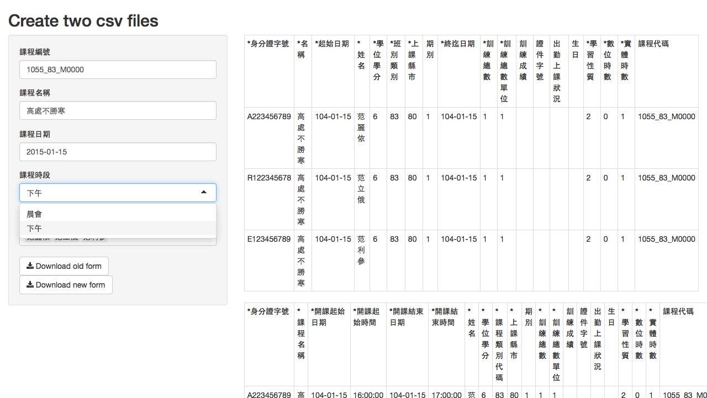
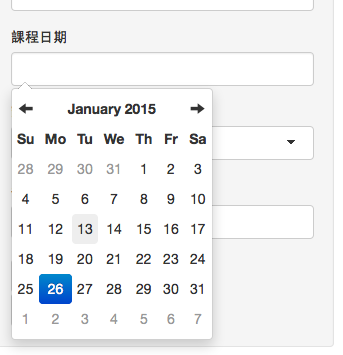

公務人員終身學習積分批次匯入 *.csv 產生器
=========================================

因應 104年 (西元2015年) 中華民國行政院人事行政總處所轄之公務人員終身學習積分批次匯入 *.csv 欄位更動。

How to use it?
-----------------------------------------
1. Edit the following two files: [member.csv](member.csv) and [timing.csv](timing.csv) (Big5 encoding csv)
2. runApp() under R command line environment
3. Fill the form and press the two "download buttons", and then get the Big5 encoding *.csv files

License
-----------------------------------------

This project is licensed under the MIT License. However, the JavaScript charting libraries that are included with this package are licensed under their own terms.

Powered by
-----------------------------------------
1.  [Shiny](http://www.rstudio.com/shiny/) 
